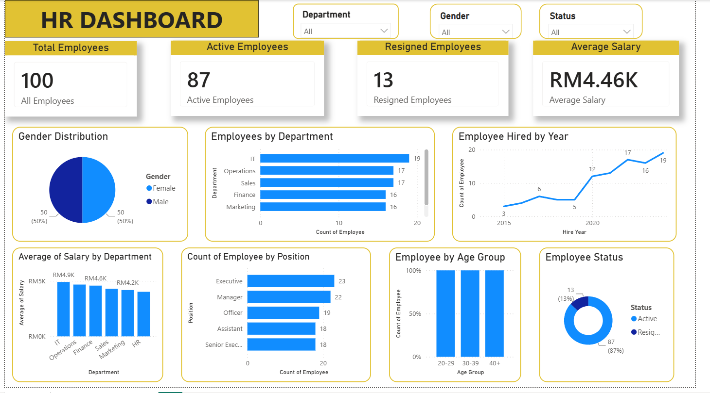
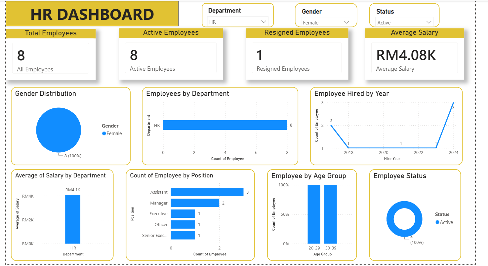

# HR Analytics Dashboard

## Project Objective
This project analyses employee data and visualises important HR metrics.

## Tools Used
- Microsoft Excel
- Power BI
- GitHub
## Dashboard Preview

### Overview

### Filter Example

## Dashboard Features
- Total Employees
- Active Employees
- Resigned Employees
- Average Salary
- Gender Distribution
- Department Analysis
- Employee Status
- Age Group Analysis

## Skills Learned
- HR Analytics
- Data Visualisation
- Dashboard Design
- Power BI
- Excel

## Author
Muhammad Syahmi Haziq bin Sahrol
Bachelor of Business in Human Resource Management (Honours)
Universiti Teknologi MARA (UiTM)
